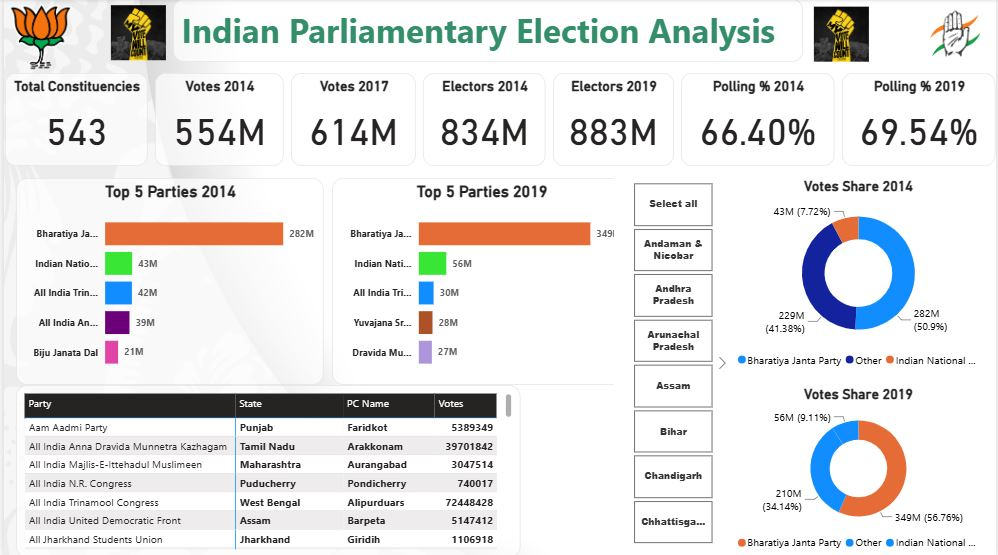

# 🇮🇳 Indian Parliamentary Election Analysis — Power BI

## 📌 Project Overview

Power BI analysis comparing India's 2014 and 2019 parliamentary elections across votes, electors, turnout, political parties, states, and constituencies.

## 🛠️ Tools

- Power BI
- Excel / CSV
- Data Cleaning
- DAX
- Data Visualization

## 📊 Key KPIs

| KPI | 2014 | 2019 |
|---|---:|---:|
| Constituencies | 543 | 543 |
| Votes | 554M | 614M |
| Electors | 834M | 883M |
| Average Turnout | 67.27% | 71.31% |

## 🔍 Key Insights

- Total votes increased from approximately **554M to 614M** between 2014 and 2019.
- Electors increased from approximately **834M to 883M**.
- Average constituency turnout increased from **67.27% to 71.31%**.
- **Bharatiya Janta Party** recorded the highest vote count in both elections.
- BJP votes increased from approximately **282M in 2014 to 349M in 2019**.

## 📈 Power BI Dashboard

## 💡 Key Takeaways

- Compare election participation and turnout across states and constituencies.
- Analyze changes in party-level vote performance between elections.
- Identify regions and constituencies with significant voting patterns.

## 📁 Files

- `india_election_2014.csv` — 2014 election dataset
- `india_election_2019.csv` — 2019 election dataset
- `Election Analysis.pbix` — Power BI project
- `Election_Analysis_Dashboard.JPG` — Dashboard preview
